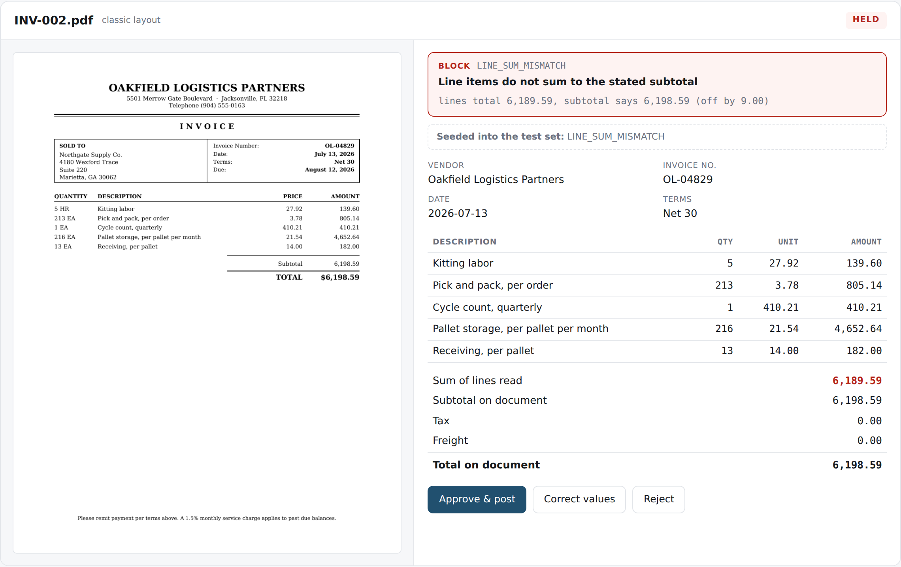
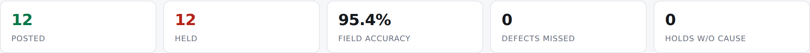
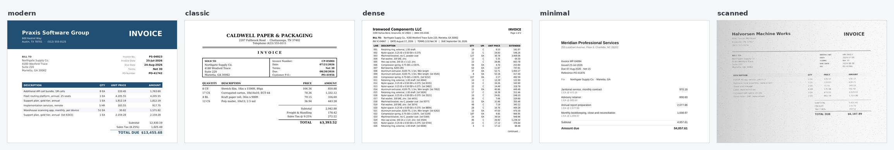

# Invoice Validation Pipeline

Reads vendor invoices, checks the numbers actually reconcile, and refuses to
post the ones that don't.

The interesting part isn't the extraction. It's what happens when the
extraction is wrong.



The document says the subtotal is 6,198.59. The line items add up to 6,189.59.
A digit was transposed somewhere between the vendor's system and the page, and
every downstream number inherits the error. No amount of reading the document
more carefully finds this — the page is perfectly legible. Only arithmetic
finds it.

So the pipeline holds it, tells a human exactly what didn't add up, and posts
nothing.

---

## The numbers

Run against 24 synthetic invoices with extraction noise deliberately injected:



**95.4% extraction accuracy. Zero bad records posted.**

Ten of 216 fields were misread. Every one was caught — not because the
extractor flagged low confidence, but because the arithmetic stopped working.

That gap is the whole argument. Extraction accuracy is a model property and it
will never be 100%. Whether bad data reaches your ledger is a *system*
property, and that can be.

---

## Why this exists

A vision model reads an invoice and tells you what it thinks the page says.
It reports a total with complete confidence whether it read that total or
hallucinated it. There is no calibrated uncertainty to threshold on.

Deterministic validation answers a different question — not *did we read this
right* but *is what we read internally consistent and safe to post*:

| Rule | Catches |
|---|---|
| Line items sum to subtotal | Transposed digits, dropped lines, misread decimals |
| subtotal + tax + freight = total | Charges on the page that never made it into the total |
| Vendor resolves to master list | Unknown senders, misread vendor names |
| Invoice number present | Documents that can't be duplicate-checked |
| Vendor + number not seen before | Double payment — the expensive AP failure |
| Date not more than a year old | Late submissions, wrong-year keying errors |
| Date not in the future | Wrong year on the vendor's template |

The first two are free, need no model confidence score, and catch most real
extraction failures. **If the arithmetic doesn't reconcile, the extraction is
wrong** — and you don't need to know why to know it needs a human.

Rules three through five catch something worse: documents that are perfectly
legible and still must not post. A duplicate invoice reads flawlessly. A
better extractor would never help.

---

## Quickstart

```bash
pip install -r requirements.txt

# poppler-utils supplies pdftoppm, used to render page images into the
# review queue. Without it the queue still builds, just without the images.
#   Debian/Ubuntu  sudo apt install poppler-utils
#   macOS          brew install poppler
#   Windows        scoop install poppler   (or any poppler build on PATH)

python3 generate_invoices.py                      # build the test set
python3 pipeline/run.py                           # clean extraction
python3 pipeline/run.py --noise 0.30 --seed 11    # with injected misreads
open out/review.html
```

No API key needed. The mock extractor replays known ground truth, so the whole
pipeline is runnable, testable and demoable at zero cost.

For real extraction against the PDFs:

```bash
pip install anthropic
export ANTHROPIC_API_KEY=...
python3 pipeline/run.py --extractor claude
```

---

## The test set

24 invoices, 239 line items, five deliberately different layouts. Everything
is invented — no real vendor, customer, person, address or phone number
appears anywhere.



The `scanned` layout has **no text layer**. It is rendered to raster and then
skewed, blurred, speckled, streaked and unevenly exposed, because a pipeline
that has only ever seen clean digital PDFs hasn't been tested. Dates appear in
four different formats. Tax and freight are sometimes a footer block,
sometimes line items, sometimes absent.

Seven documents carry a seeded defect — one each of the failure modes in the
table above. Seventeen are clean, on purpose: a validator that flags
everything proves nothing.

### How ground truth is recorded

`manifest.json` records **what is printed on the page**, not what would have
been arithmetically correct.

For the transposed-subtotal invoice, ground truth *is* the wrong subtotal,
because that is what the document says. A perfect extractor returns it. The
validator then flags it.

Scoring extraction against "what it should have been" would penalise an
extractor for reading the document correctly. Two separate questions, measured
separately.

---

## Layout

```
generate_invoices.py    builds the test set (seeded — reproducible)
dataset.py              fictitious companies, vendors, line-item catalogs
verify_testset.py       self-test: proves every seeded defect is detectable
                        and no clean document is flagged

pipeline/
  extractors.py         MockExtractor (replays ground truth, can inject
                        realistic misreads) and ClaudeExtractor (vision API).
                        One interface — the extractor is the swappable part.
  validation.py         the seven rules; readable as a spec
  run.py                orchestration, routing, scoring
  review.py             builds the review queue HTML

out/
  invoices/             24 PDFs
  manifest.json         ground truth
  results.json          full run output
  review.html           the review queue
  vendors.csv           vendor master list, ready to import
```

### One prompt detail worth stealing

```
Transcribe, do not calculate. If the printed subtotal does not match what
the line items add up to, return the printed subtotal anyway.
```

Without that instruction a capable model quietly "fixes" the arithmetic to
make the document consistent — destroying the exact signal the validation
layer exists to detect. Worth knowing before pointing any model at financial
documents.

---

## Deliberately not included

**No accounting-system write.** The destination is a thin adapter at the end
of the pipeline; the hard part is everything before it. QuickBooks Desktop via
qbXML, QBO via REST, or a CSV import all attach at the same point.

**No persistence.** Duplicate detection spans a single run. Real deployment
needs that ledger in a database.

**No write-back from review.** The queue shows the decision a person would
make. Recording it is a workflow, not a demo.

---

## License

MIT — see [LICENSE](LICENSE).
